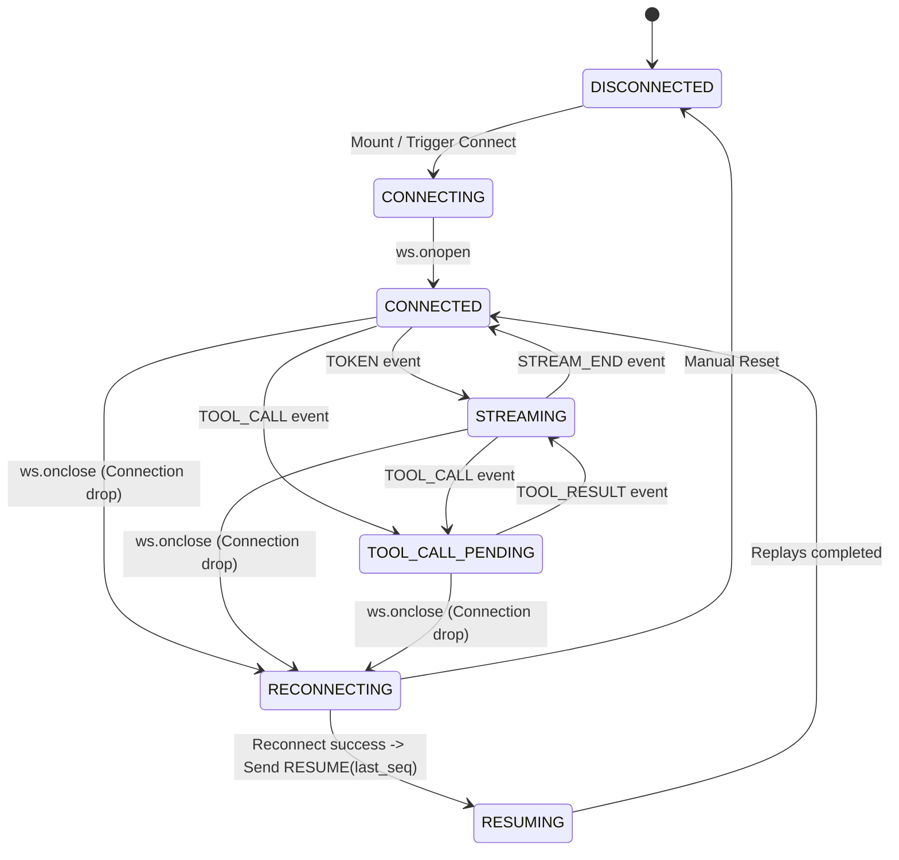

# Agent Console - Alchemyst AI Assignment

An **Agent Console** built on Next.js 16 (App Router, React 19, TypeScript) that connects to a mock AI agent backend over WebSockets. It handles real-time token streaming, mid-stream tool call interruptions, live trace logging, and differential context inspection, all while surviving connection drops, shuffled sequence deliveries, and malformed heartbeats in **chaos mode**.

---

## 1. Architectural Approach (Summary)
The console separates the raw WebSocket network layer from the React state engine using a custom-built **Reordering Buffer** with global deduplication. The network layer immediately acknowledges heartbeats (PING/PONG) and critical protocol synchronization (TOOL_ACK) to bypass queuing latency, while the reordering queue buffers out-of-order packets and stitches them sequentially into the DOM. Messages are rendered as structural arrays of content blocks to eliminate layout shifts when tool cards are inserted mid-stream.

---

## 2. WebSocket Connection State Machine



---

## 3. How to Run the Application

### Prerequisites
* **Node.js 20+** installed
* **Docker** installed and running

### Step 1: Start the Backend Server
You can run the provided server container in either normal or chaos mode.

```bash
# Clone the repository and navigate to the server
cd agent-server

# Build the server image
docker build -t agent-server .

# Run in Normal Mode
docker run -p 4747:4747 agent-server

# Run in Chaos Mode (Connection drops, shuffled seqs, latency spikes)
docker run -p 4747:4747 agent-server --mode chaos
```

### Step 2: Start the Next.js Frontend Console
From the root directory of this repository:

```bash
# Install dependencies
npm install

# Run Jest unit tests to verify the reordering buffer and diff engine
npm run test

# Run Next.js in development mode
npm run dev

# Open the console in your browser
# Navigate to http://localhost:3000
```

---

## 4. Normal Mode Screenshots

### A. Streamed Response with a Tool Call & Active Trace
The main panel shows tokens rendering smoothly. When a tool call is invoked, the streaming freezes in place, a tool card appears showing argument payloads, and the trace timeline updates.


### B. Bidirectional Highlighting
Clicking a tool card in the chat pane scrolls the timeline directly to its corresponding `TOOL_CALL` trace and flashes a pulse highlight. Clicking a timeline event scrolls the chat directly to that element.


### C. Differential Context Inspector
When a new `CONTEXT_SNAPSHOT` arrives, the inspector computes a deep nested JSON diff, highlighting added keys in green, deleted keys in red (strike-through), and modified values in yellow. The user can scrub through history to review states.


---

## 5. Chaos Survival Screen Recording (Task 5)

The screen recording demonstrates the Agent Console surviving all of the chaos mode behaviors (connection drop mid-stream, out-of-order reordering, rapid tool calls, oversized 500KB+ context, and corrupt heartbeats).

* **View Chaos Mode Recording:** [media/chaos_mode_flow.webp](./media/chaos_mode_flow.webp)
* **View Normal Mode Recording:** [media/normal_mode_flow.webp](./media/normal_mode_flow.webp)
