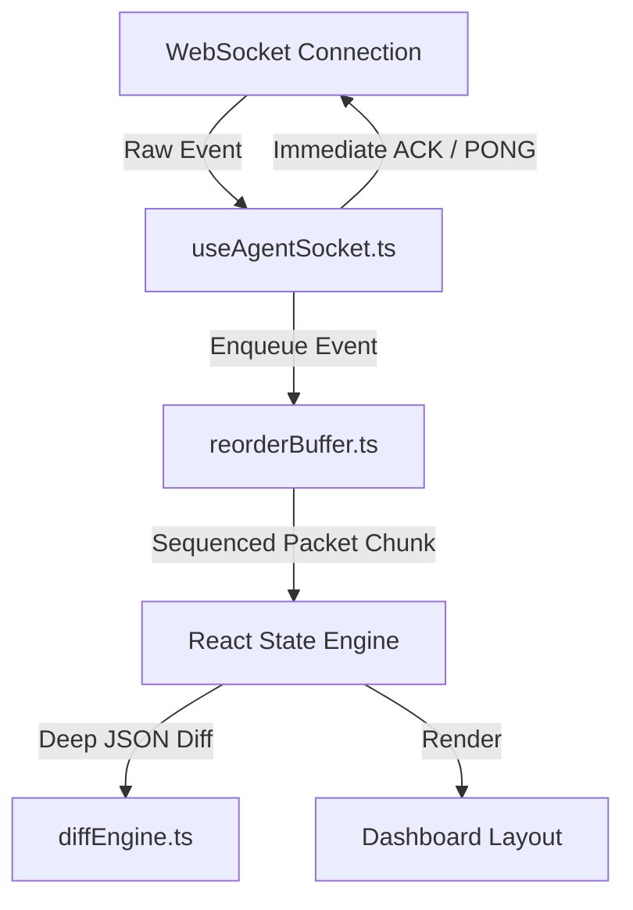
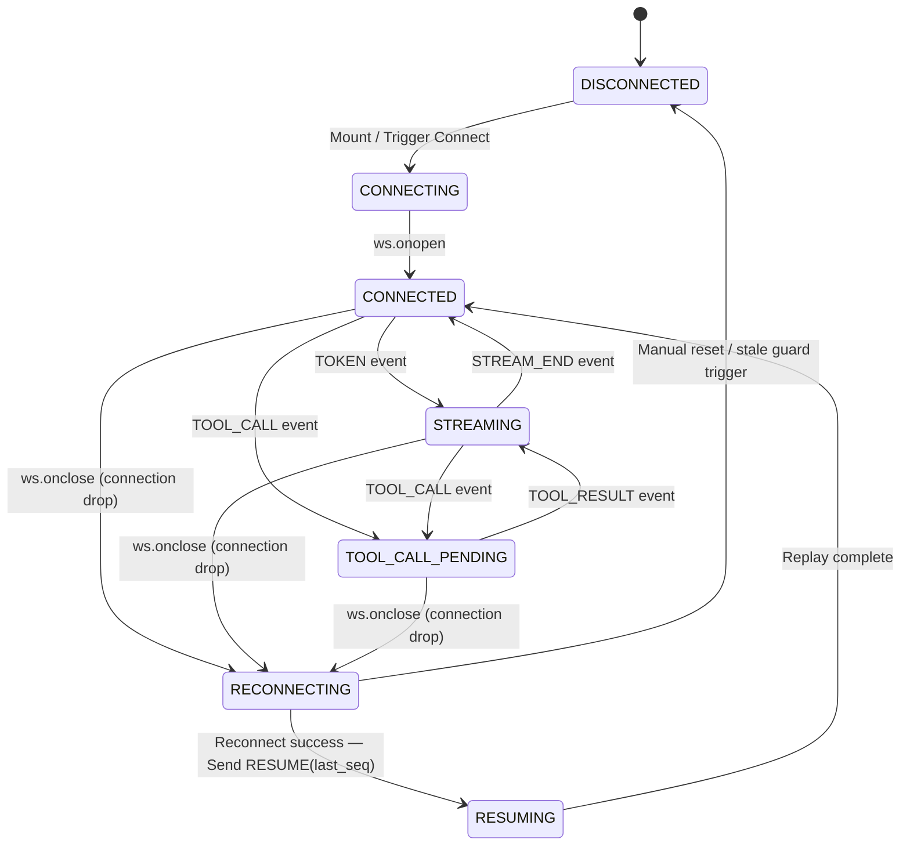
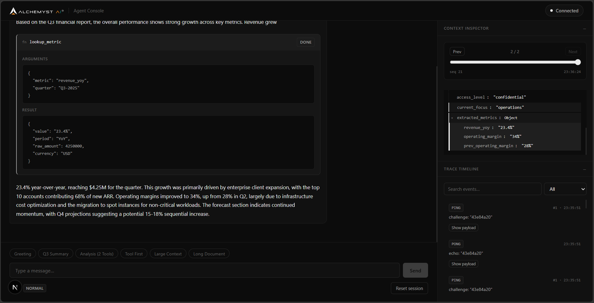
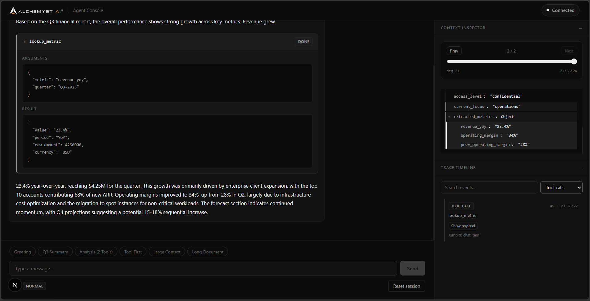
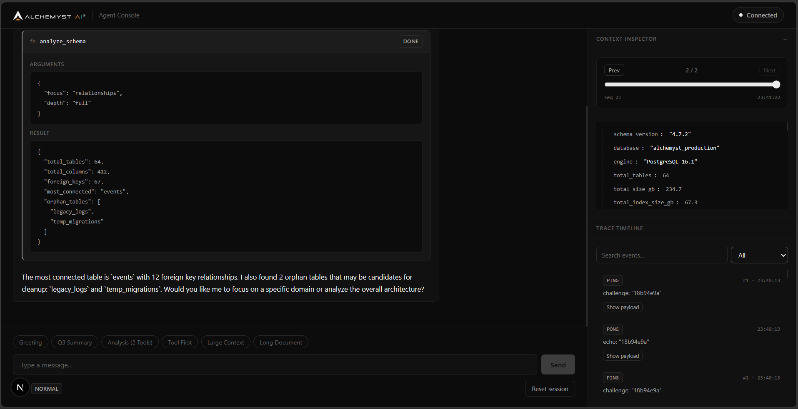

# Alchemyst AI — Resilient Agent Console

[](https://nextjs.org/)
[](https://react.dev/)
[](https://www.typescriptlang.org/)
[](https://jestjs.io/)

A production-grade **Agent Console** built on **Next.js 16 (App Router)** with **React 19** and **strict TypeScript**. The application connects to a mock AI agent backend over WebSockets and renders token streams, tool cards, trace timelines, and differential context diffs under both standard and extreme network conditions.

The console is engineered to survive all **Chaos Mode** failure modes — connection drops, shuffled packets, duplicate frames, delayed heartbeats, and massive context payloads — without UI freezes or layout shifts.

---

## Key Features

| Feature                         | Description                                                                                                              |
| :------------------------------ | :----------------------------------------------------------------------------------------------------------------------- |
| **Strict Sequenced Rendering**  | All packets are buffered and sorted by sequence number before any DOM commit.                                            |
| **Layout-Shift-Free Streaming** | Structured content block arrays allow tool card insertions to interrupt and resume streaming without visual artifacts.   |
| **Lazy Differential Trees**     | Deep recursive JSON differences are computed and mounted lazily, enabling instant renders of 500 KB+ state models.       |
| **Stale Connection Guards**     | Double-buffered socket listeners prevent asynchronous callback pollution from discarded sockets during reconnect cycles. |

---

## Architecture

The application decouples the raw WebSocket network layer from React's virtual DOM reconciliation by routing all events through pure, independently testable utility modules.



> [!NOTE]
> **Design Priority:** Resiliency and visual state correctness were prioritised over decorative styling. The interface uses CSS custom properties with a dark glassmorphic theme that remains fully functional under sustained network stress.

---

## Chaos Mode Resiliency Matrix

| Failure Mode                   | Server Behaviour                                               | Client Resiliency Mechanism                                                                                                                                          |
| :----------------------------- | :------------------------------------------------------------- | :------------------------------------------------------------------------------------------------------------------------------------------------------------------- |
| **Connection Drop Mid-Stream** | Socket forcefully terminated mid-sentence.                     | Exponential-backoff reconnect (capped at 10 s). Sends `RESUME(last_seq)` on reconnect; server replays missed events, client deduplicates and stitches them in order. |
| **Out-of-Order Messages**      | Packets delivered in shuffled sequence order.                  | `ReorderBuffer` holds packets and resolves sequence gaps before releasing consecutive events to the render state.                                                    |
| **Duplicate Frame Delivery**   | Identical frames transmitted more than once.                   | A `Set<number>` of processed sequence IDs discards duplicates in O(1) time.                                                                                          |
| **Oversized Context Snapshot** | 500 KB+ JSON schema object dispatched.                         | `diffEngine.ts` computes recursive leaf differences. Tree nodes are mounted lazily — children only enter the DOM on user expansion — keeping initial paint at O(1).  |
| **Corrupt Heartbeat**          | `PING` sent with an empty challenge string.                    | Challenge defaults safely to `""`. A valid `PONG` is echoed immediately to prevent server-side timeout termination.                                                  |
| **Stale Socket Closures**      | Old close events fire asynchronously after socket replacement. | Active-socket identity guards (`if (socketRef.current !== ws) return`) on all handlers prevent discarded sockets from resetting the active connection state.         |

---

## WebSocket Protocol Handlers

| Event Type         | Direction | Payload Structure                                       | Client Action                                                                           |
| :----------------- | :-------: | :------------------------------------------------------ | :-------------------------------------------------------------------------------------- |
| `USER_MESSAGE`     |    Out    | `{"type": "USER_MESSAGE", "content": "..."}`            | Resets sequence trackers and transmits user input to the backend.                       |
| `CONTEXT_SNAPSHOT` |    In     | `{"type": "CONTEXT_SNAPSHOT", "seq": N, "data": {...}}` | Parses state variables, runs the diff engine, and renders lazy trees.                   |
| `TOKEN`            |    In     | `{"type": "TOKEN", "seq": N, "text": "..."}`            | Appends characters to the active chat bubble and groups trace logs.                     |
| `TOOL_CALL`        |    In     | `{"type": "TOOL_CALL", "seq": N, "call_id": "..."}`     | Bypasses the reorder queue to immediately send `TOOL_ACK`, then enqueues the tool card. |
| `TOOL_ACK`         |    Out    | `{"type": "TOOL_ACK", "call_id": "..."}`                | Acknowledges tool call receipt within the server's 5 s timeout window.                  |
| `TOOL_RESULT`      |    In     | `{"type": "TOOL_RESULT", "seq": N, "result": {...}}`    | Resolves the pending tool card in-place and resumes token streaming.                    |
| `STREAM_END`       |    In     | `{"type": "STREAM_END", "seq": N}`                      | Finalises the stream and returns the socket status to Connected / Idle.                 |
| `PING` / `PONG`    | In / Out  | `{"type": "PING", "challenge": "..."}`                  | Verifies connection health; client replies within 3 s.                                  |
| `RESUME`           |    Out    | `{"type": "RESUME", "last_seq": N}`                     | Transmits sequence watermark to recover missed server frames after reconnection.        |

---

## WebSocket Connection State Machine



---

## Running the Application

### Prerequisites

- Node.js 20 or later
- Docker Desktop (installed and running)

### Step 1 — Start the Backend Server

```bash
cd agent-server

# Build the server image
docker build -t agent-server .

# Normal mode (tutorial scenario)
docker run -p 4747:4747 agent-server

# Chaos mode (simulates packet loss, reordering, and latency)
docker run -p 4747:4747 agent-server --mode chaos
```

### Step 2 — Start the Frontend Console

Open a new terminal in the project root:

```bash
# Install dependencies
npm install

# Run unit tests (reorder buffer and diff engine)
npm run test

# Start the development server
npm run dev
```

Navigate to `http://localhost:3000`.

---

## Chaos Survival Recordings (Task 5)

The recordings demonstrate the console handling latency spikes, out-of-order execution, dropped sockets, and 500 KB+ JSON frames without visible regressions.

| Mode        | Recording                                                    |
| :---------- | :----------------------------------------------------------- |
| Chaos Mode  | [media/chaos_mode_flow.webp](./media/chaos_mode_flow.webp)   |
| Normal Mode | [media/normal_mode_flow.webp](./media/normal_mode_flow.webp) |

---

## Screenshots — Normal Mode Walkthrough

### Streamed Response with Tool Call and Trace Timeline

Preceding text pauses, a pending tool card appears inline, and the trace timeline records all frames in sequence.



### Bidirectional Scroll Highlighting

Clicking a tool card in the chat scrolls the timeline to its corresponding `TOOL_CALL` trace entry and flashes a pulse highlight. Clicking a timeline event scrolls the chat panel back to that element.



### Differential Context Inspector

Computes deep nested JSON differences, highlighting added keys in green, deleted keys in red, and modified values in amber. Includes a scrubbing history slider for reviewing prior snapshots.


