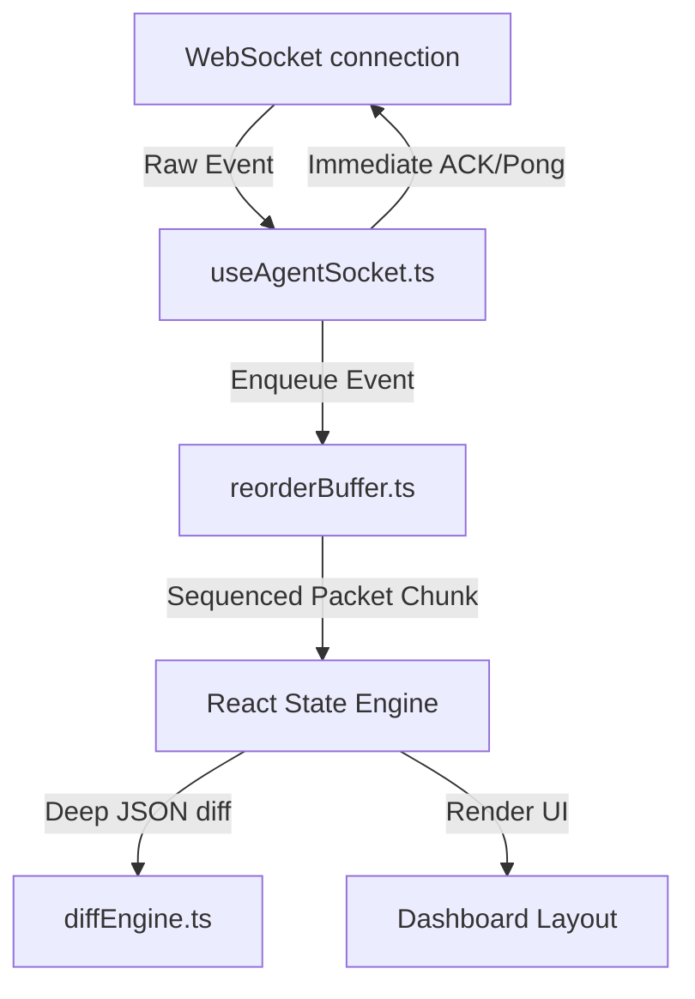
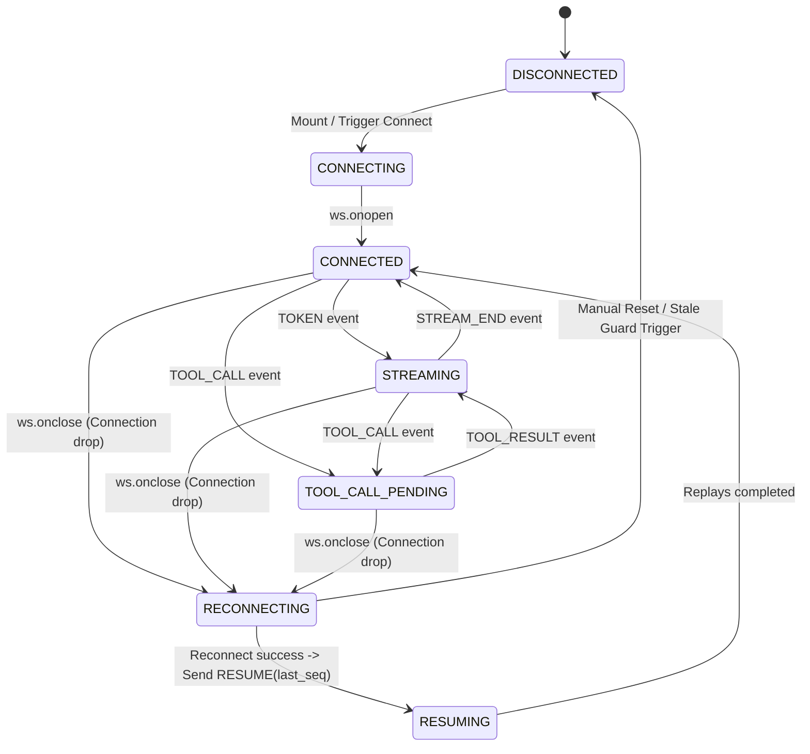
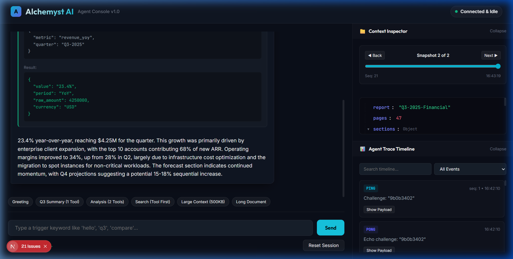
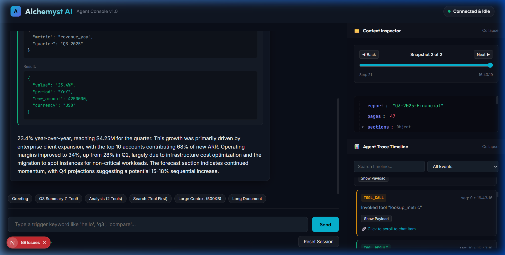
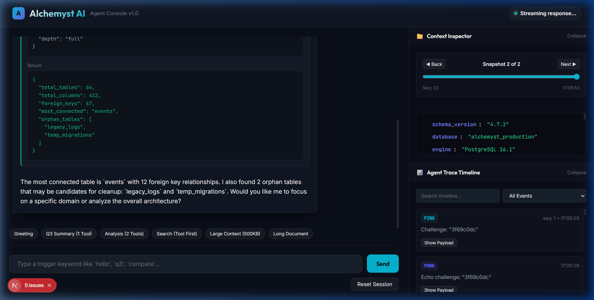

# Alchemyst AI - Resilient Agent Console
[](https://nextjs.org/)
[](https://react.dev/)
[](https://www.typescriptlang.org/)
[](https://jestjs.io/)

A state-of-the-art **Agent Console** built on **Next.js 16 (App Router, React 19, and strict TypeScript)**. It connects to a mock AI agent backend over WebSockets, rendering token streams, tool cards, trace timelines, and differential context diffs under standard and extreme network scenarios.

The console is specifically engineered to survive all **Chaos Mode** failure modes (connection drops, shuffled packets, duplicate frames, delayed heartbeats, and massive context payloads) without UI freezes or layout jumps.

---

## 🚀 Key Features

* **Strict Sequenced Rendering:** All packets are buffered and sorted in sequence order before committing to the DOM.
* **Layout-Shift-Free Streaming:** Uses structured content block arrays so tool card insertions interrupt and resume streaming without visual shifts.
* **Lazy Differential Trees:** Computes deep recursive nested JSON differences and mounts nodes lazily, allowing instant renders of 500KB+ state models.
* **Stale Connection Guards:** Double-buffered socket listeners protect active socket references from asynchronous callback pollution during reconnect cycles.

---

## 🏛️ Architecture & Priorities

The application isolates the raw WebSocket network layer from React's virtual DOM reconciliation by utilizing pure, testable utility classes:



> [!NOTE]
> **Priority Decision:** We prioritized **resiliency and visual state correctness** over visual design fluff. The styling uses custom CSS variables with a dark glassmorphic interface that remains completely functional and responsive under active stress.

---

## ⚡ Chaos Mode Resiliency Matrix

| Chaos Failure Mode | Server Behavior | Client Resiliency Mechanism (Our Solution) |
| :--- | :--- | :--- |
| **Connection Drop Mid-Stream** | Socket connection is forcefully terminated mid-sentence. | <ul><li>Triggers automatic reconnection using exponential backoff (capped at 10s).</li><li>Sends a `RESUME(last_seq)` handshake immediately upon reconnection.</li><li>Server replays missed events; client deduplicates and stitches them in order.</li></ul> |
| **Out-of-Order Messages** | Packets are shuffled and delivered out of sequential order. | <ul><li>Packets are held in a `ReorderBuffer` queue.</li><li>Resolves sequence gaps before releasing consecutive events to the React rendering state.</li></ul> |
| **Duplicate Message Delivery** | Duplicate frames with the same sequence are transmitted. | <ul><li>Maintains a lookup `Set<number>` of processed sequences.</li><li>Discards duplicate frames in $O(1)$ time.</li></ul> |
| **Oversized Context Snapshot** | Dispatches a 500KB+ JSON schema object. | <ul><li>Uses `diffEngine.ts` to compute recursive leaf differences.</li><li>Renders tree nodes recursively and **lazily** (children only mount in DOM on expand), keeping initial paint at $O(1)$.</li></ul> |
| **Corrupt Heartbeat** | Sends a `PING` with an empty challenge string. | <ul><li>Safely defaults the challenge to `""`.</li><li>Echoes back a valid `PONG` to prevent server-side connection termination.</li></ul> |
| **Stale Socket Closures** | Connection replacements fire old close events asynchronously. | <ul><li>Employs active-socket identity guards (`if (socketRef.current !== ws) return`) on all handlers.</li><li>Stops old, discarded sockets from resetting active connections to `DISCONNECTED`.</li></ul> |

---

## 📊 WebSocket Protocol Handlers

| Event Type | Direction | Payload Structure | Client Action |
| :--- | :---: | :--- | :--- |
| **`USER_MESSAGE`** | `Out` | `{"type": "USER_MESSAGE", "content": "..."}` | Resets client sequence trackers and sends user input to the backend. |
| **`CONTEXT_SNAPSHOT`** | `In` | `{"type": "CONTEXT_SNAPSHOT", "seq": N, "data": {...}}` | Parses state variables, runs diff engine, and renders lazy trees. |
| **`TOKEN`** | `In` | `{"type": "TOKEN", "seq": N, "text": "..."}` | Appends characters to the active chat bubble and groups logs. |
| **`TOOL_CALL`** | `In` | `{"type": "TOOL_CALL", "seq": N, "call_id": "..."}` | Bypasses queue to immediately send `TOOL_ACK`, then enqueues card. |
| **`TOOL_ACK`** | `Out` | `{"type": "TOOL_ACK", "call_id": "..."}` | Acknowledges tool call receipt within the server's 5s timeout window. |
| **`TOOL_RESULT`** | `In` | `{"type": "TOOL_RESULT", "seq": N, "result": {...}}` | Resolves the pending tool card in-place and resumes token streaming. |
| **`STREAM_END`** | `In` | `{"type": "STREAM_END", "seq": N}` | Finalizes the stream and returns socket status to Connected & Idle. |
| **`PING` / `PONG`** | `In` / `Out` | `{"type": "PING", "challenge": "..."}` | Verifies connection health; client replies within 3 seconds. |
| **`RESUME`** | `Out` | `{"type": "RESUME", "last_seq": N}` | Transmits sequence watermark to recover missed server frames. |

---

## 🗺️ WebSocket Connection State Machine



---

## 🛠️ How to Run the Application

### Prerequisites
* **Node.js 20+** installed
* **Docker** installed and running

### Step 1: Start the Backend Server
Build and run the mock agent server in your terminal:
```bash
# Navigate to the server folder
cd agent-server

# Build the server Docker image
docker build -t agent-server .

# Run in Normal Mode (Tutorial mode)
docker run -p 4747:4747 agent-server

# OR Run in Chaos Mode (Job mode - simulates heavy packet loss and latency)
docker run -p 4747:4747 agent-server --mode chaos
```

### Step 2: Start the Next.js Frontend Console
Open a new terminal window in the root directory:
```bash
# Install dependencies
npm install

# Run Jest unit tests to verify reordering and diff correctness
npm run test

# Run Next.js in development mode
npm run dev

# Open in browser: navigate to http://localhost:3000
```

---

## 🎥 Chaos Survival Screen Recording (Task 5)

The screen recordings demonstrate the console handling latency spikes, out-of-order execution, dropped sockets, and 500KB+ JSON frames:

* **Chaos Mode Video Recording:** [media/chaos_mode_flow.webp](./media/chaos_mode_flow.webp)
* **Normal Mode Video Recording:** [media/normal_mode_flow.webp](./media/normal_mode_flow.webp)

---

## 🖼️ Normal Mode Walkthrough Screenshots

### A. Streamed Response with Tool Call & Trace Timeline
Preceding text freezes, a pending tool card appears, and the trace timeline records all frames.


### B. Bidirectional Scroll Highlighting
Clicking a tool card in the chat scrolls the timeline to its `TOOL_CALL` trace and flashes a pulse highlight. Clicking a timeline event scrolls the chat back to that element.


### C. Differential Context Inspector
Computes deep nested JSON differences, highlighting added keys in green, deleted keys in red, and modified values. Includes a scrubbing history slider.


